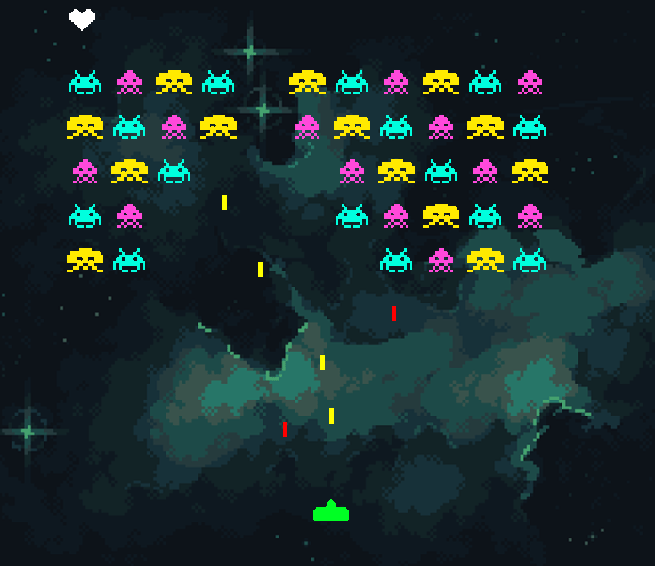

# Space Invaders (Python Turtle)

A simple Space Invaders game built using Python's Turtle graphics library.  
You control the ship, shoot lasers, and destroy waves of invaders!

---



---

## How to Play

- Use **Left** and **Right** arrow keys to move.
- Press **Space** to shoot.

---

## Features

- Retro-style pixel collision
- Invader wave generation
- Bullet mechanics
- Clean game loop with keyboard controls
- Simple modular structure

---

## Requirements

- Python 3.10+
- No external libraries — just built-in `turtle`

---

## Run the Game

```bash
python app.py
```
